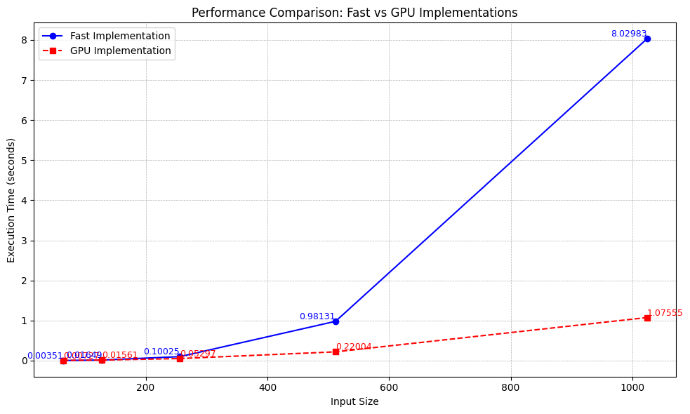
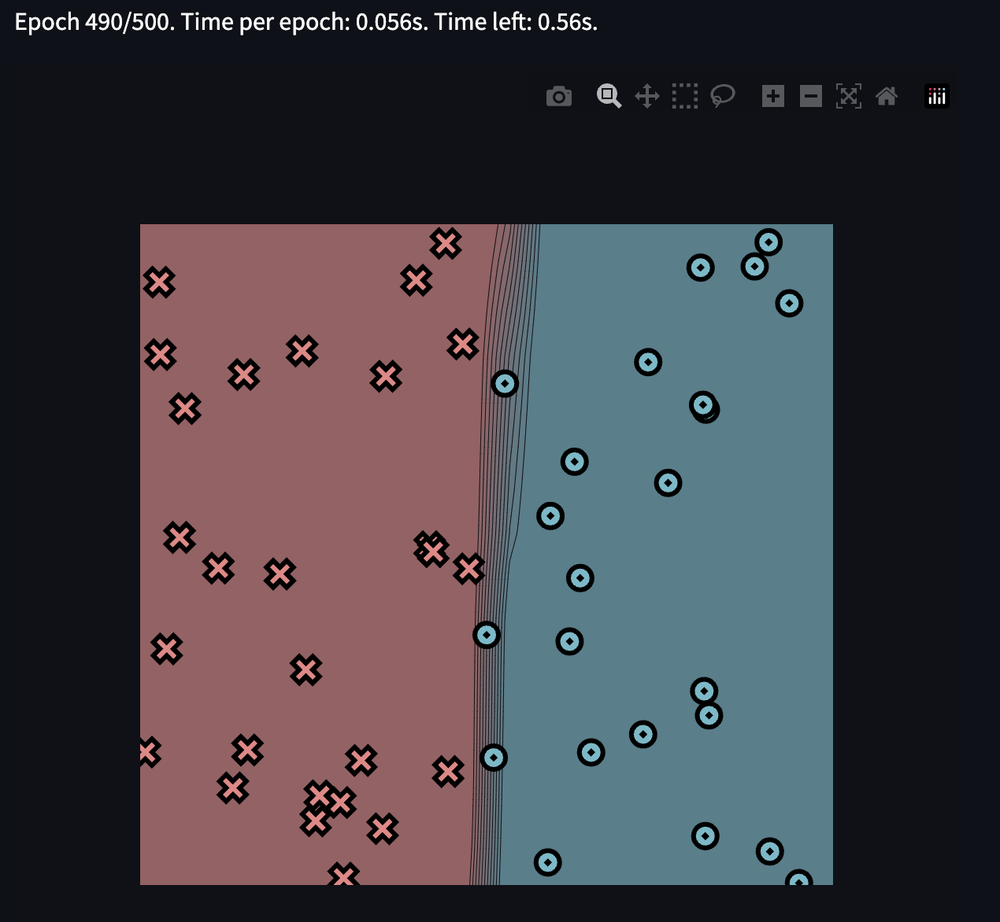
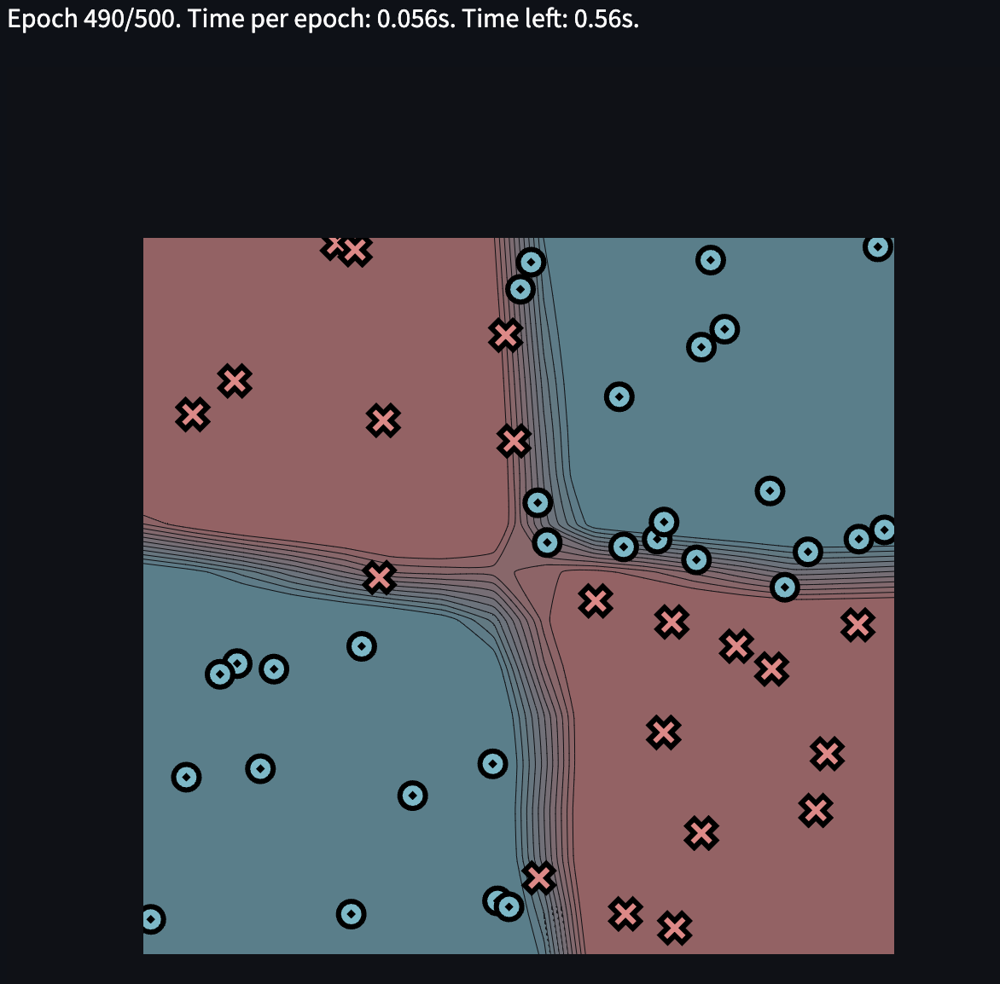
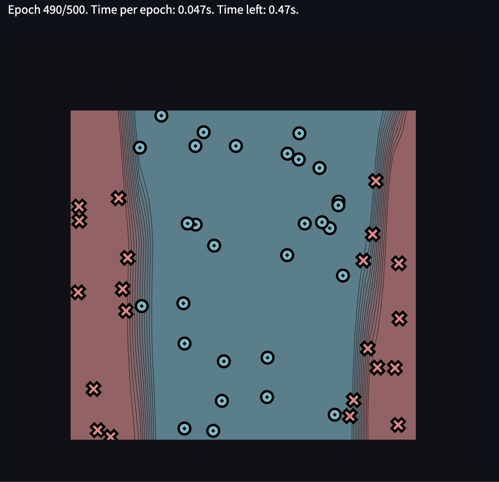
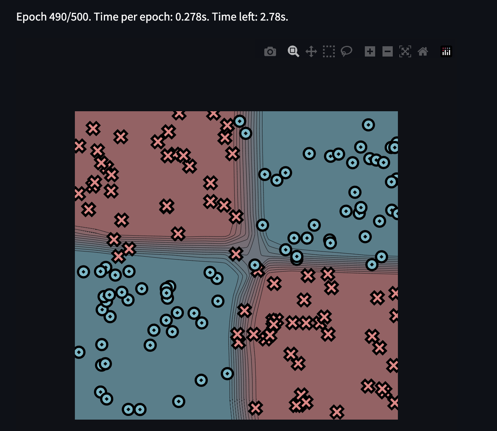

# MiniTorch Module 3


* Docs: https://minitorch.github.io/

* Overview: https://minitorch.github.io/module3.html


You will need to modify `tensor_functions.py` slightly in this assignment.

* Tests:

```
python run_tests.py
```

* Note:

Several of the tests for this assignment will only run if you are on a GPU machine and will not
run on github's test infrastructure. Please follow the instructions to setup up a colab machine
to run these tests.

This assignment requires the following files from the previous assignments. You can get these by running

```bash
python sync_previous_module.py previous-module-dir current-module-dir
```

The files that will be synced are:

        minitorch/tensor_data.py minitorch/tensor_functions.py minitorch/tensor_ops.py minitorch/operators.py minitorch/scalar.py minitorch/scalar_functions.py minitorch/module.py minitorch/autodiff.py minitorch/module.py project/run_manual.py project/run_scalar.py project/run_tensor.py minitorch/operators.py minitorch/module.py minitorch/autodiff.py minitorch/tensor.py minitorch/datasets.py minitorch/testing.py minitorch/optim.py

CPU Benchmark
==========================================================

3.4 Graph - Fast vs GPU 


python run_fast_tensor.py --BACKEND cpu --HIDDEN 100 --DATASET simple --RATE 0.05
SIMPLE - PTS = 50, Time per epoch: 0.056s

Epoch: 0/500, loss: 5.510770925131599, correct: 43
Epoch: 10/500, loss: 1.308108169283846, correct: 48
Epoch: 20/500, loss: 2.0226730918602196, correct: 50
Epoch: 30/500, loss: 2.7276136252454095, correct: 48
Epoch: 40/500, loss: 1.581263613567763, correct: 50
Epoch: 50/500, loss: 1.3503437303093444, correct: 50
Epoch: 60/500, loss: 0.2516363006998117, correct: 49
Epoch: 70/500, loss: 1.1402573259847495, correct: 50
Epoch: 80/500, loss: 0.7226960542483082, correct: 49
Epoch: 90/500, loss: 1.300208666797393, correct: 49
Epoch: 100/500, loss: 1.705014006637593, correct: 49
Epoch: 110/500, loss: 0.44572763212904154, correct: 50
Epoch: 120/500, loss: 0.2099705830514798, correct: 50
Epoch: 130/500, loss: 0.6444070622131115, correct: 50
Epoch: 140/500, loss: 1.4465442195330385, correct: 50
Epoch: 150/500, loss: 0.7182191952083985, correct: 50
Epoch: 160/500, loss: 0.3348845558367059, correct: 49
Epoch: 170/500, loss: 1.2716342136478125, correct: 49
Epoch: 180/500, loss: 1.4162639723101391, correct: 49
Epoch: 190/500, loss: 0.2095550043933654, correct: 50
Epoch: 200/500, loss: 0.033953532338250214, correct: 50
Epoch: 210/500, loss: 1.078477735066842, correct: 50
Epoch: 220/500, loss: 0.45209454677653327, correct: 50
Epoch: 230/500, loss: 0.08092435006716671, correct: 50
Epoch: 240/500, loss: 0.9442462272461805, correct: 49
Epoch: 250/500, loss: 0.5112053953955406, correct: 50
Epoch: 260/500, loss: 0.311366804952063, correct: 50
Epoch: 270/500, loss: 0.14270186319732597, correct: 50
Epoch: 280/500, loss: 0.48272332098053383, correct: 50
Epoch: 290/500, loss: 0.902761935993342, correct: 50
Epoch: 300/500, loss: 0.42271756094201585, correct: 50
Epoch: 310/500, loss: 0.23567990261397082, correct: 50
Epoch: 320/500, loss: 0.5941975854824726, correct: 49
Epoch: 330/500, loss: 0.052840921096792025, correct: 49
Epoch: 340/500, loss: 0.17773353195726932, correct: 50
Epoch: 350/500, loss: 0.023412576725456276, correct: 50
Epoch: 360/500, loss: 0.4205770577922203, correct: 50
Epoch: 370/500, loss: 0.40636551925409997, correct: 50
Epoch: 380/500, loss: 0.2960904876817464, correct: 50
Epoch: 390/500, loss: 0.016021573386680317, correct: 50
Epoch: 400/500, loss: 0.1586842593411063, correct: 50
Epoch: 410/500, loss: 0.05180752539213765, correct: 50
Epoch: 420/500, loss: 4.452561204517035e-06, correct: 49
Epoch: 430/500, loss: 0.5085481800664815, correct: 50
Epoch: 440/500, loss: 0.014457117963307863, correct: 50
Epoch: 450/500, loss: 0.6612987101176901, correct: 50
Epoch: 460/500, loss: 0.36252988869967295, correct: 50
Epoch: 470/500, loss: 0.0047279841183412155, correct: 48
Epoch: 480/500, loss: 0.6904147014812084, correct: 50
Epoch: 490/500, loss: 0.3981231184195425, correct: 50



python run_fast_tensor.py --BACKEND cpu --HIDDEN 100 --DATASET xor --RATE 0.05
XOR - PTS = 50, Time per epoch: 0.056s

Epoch: 0/500, loss: 7.70619974711196, correct: 22
Epoch: 10/500, loss: 5.718800206687095, correct: 44
Epoch: 20/500, loss: 4.5931958334047716, correct: 38
Epoch: 30/500, loss: 5.008205264156273, correct: 44
Epoch: 40/500, loss: 3.5497100783079634, correct: 39
Epoch: 50/500, loss: 3.371488062585911, correct: 42
Epoch: 60/500, loss: 3.8185508463033617, correct: 39
Epoch: 70/500, loss: 3.310268728503508, correct: 44
Epoch: 80/500, loss: 3.029323542303542, correct: 43
Epoch: 90/500, loss: 3.5775538430748477, correct: 45
Epoch: 100/500, loss: 3.8270666253950574, correct: 42
Epoch: 110/500, loss: 7.225485617122185, correct: 40
Epoch: 120/500, loss: 4.044671509184525, correct: 44
Epoch: 130/500, loss: 3.0660333083292137, correct: 45
Epoch: 140/500, loss: 1.4411132152740482, correct: 43
Epoch: 150/500, loss: 1.2031318038831484, correct: 44
Epoch: 160/500, loss: 4.283400755577967, correct: 44
Epoch: 170/500, loss: 2.7805781981543563, correct: 46
Epoch: 180/500, loss: 3.3216529618320205, correct: 45
Epoch: 190/500, loss: 1.944030869171591, correct: 45
Epoch: 200/500, loss: 3.599958227239509, correct: 43
Epoch: 210/500, loss: 1.9483744697578615, correct: 46
Epoch: 220/500, loss: 2.013257746008017, correct: 44
Epoch: 230/500, loss: 1.4895809222016028, correct: 45
Epoch: 240/500, loss: 1.7826795508441298, correct: 47
Epoch: 250/500, loss: 1.936891189707208, correct: 46
Epoch: 260/500, loss: 2.0045515982627164, correct: 48
Epoch: 270/500, loss: 3.052938159577842, correct: 48
Epoch: 280/500, loss: 1.7141014342845982, correct: 46
Epoch: 290/500, loss: 3.457723799807868, correct: 49
Epoch: 300/500, loss: 4.07158851758284, correct: 48
Epoch: 310/500, loss: 2.9275094454853776, correct: 50
Epoch: 320/500, loss: 2.4041081282447334, correct: 49
Epoch: 330/500, loss: 1.4175433309558119, correct: 47
Epoch: 340/500, loss: 2.500470887571212, correct: 44
Epoch: 350/500, loss: 3.414823642316913, correct: 44
Epoch: 360/500, loss: 1.4943206923731567, correct: 48
Epoch: 370/500, loss: 1.8724597489671522, correct: 46
Epoch: 380/500, loss: 0.8874843460609542, correct: 45
Epoch: 390/500, loss: 2.144833680245781, correct: 50
Epoch: 400/500, loss: 0.3388626222037676, correct: 46
Epoch: 410/500, loss: 1.884822100316034, correct: 48
Epoch: 420/500, loss: 0.9457834828915134, correct: 47
Epoch: 430/500, loss: 1.9224717653072863, correct: 43
Epoch: 440/500, loss: 0.8303739377968791, correct: 48
Epoch: 450/500, loss: 1.3059941088801128, correct: 47
Epoch: 460/500, loss: 2.2791180198366536, correct: 47
Epoch: 470/500, loss: 1.894280638124304, correct: 49
Epoch: 480/500, loss: 1.0217812262667525, correct: 50
Epoch: 490/500, loss: 0.04799079159743839, correct: 48



python run_fast_tensor.py --BACKEND cpu --HIDDEN 100 --DATASET split --RATE 0.05
SPLIT - PTS = 50, Time per epoch: 0.047s

Epoch: 0/500, loss: 6.128488385580209, correct: 35
Epoch: 10/500, loss: 5.250988224039283, correct: 39
Epoch: 20/500, loss: 4.169817217507638, correct: 44
Epoch: 30/500, loss: 2.7347891715020416, correct: 47
Epoch: 40/500, loss: 3.6099638137560714, correct: 46
Epoch: 50/500, loss: 2.4980862321327715, correct: 46
Epoch: 60/500, loss: 2.270447631261073, correct: 48
Epoch: 70/500, loss: 2.442285963155582, correct: 47
Epoch: 80/500, loss: 1.9118053323975868, correct: 46
Epoch: 90/500, loss: 2.132638572200696, correct: 48
Epoch: 100/500, loss: 0.8995506044982784, correct: 46
Epoch: 110/500, loss: 1.4369142942630628, correct: 47
Epoch: 120/500, loss: 2.4039191443681895, correct: 49
Epoch: 130/500, loss: 1.3751187295664036, correct: 48
Epoch: 140/500, loss: 1.6265378845184137, correct: 48
Epoch: 150/500, loss: 1.5867743968517682, correct: 49
Epoch: 160/500, loss: 1.665390689106339, correct: 48
Epoch: 170/500, loss: 1.9847707437837214, correct: 48
Epoch: 180/500, loss: 1.119607608710135, correct: 47
Epoch: 190/500, loss: 0.19269127549166457, correct: 48
Epoch: 200/500, loss: 1.0293709290868827, correct: 49
Epoch: 210/500, loss: 3.0437836497802095, correct: 48
Epoch: 220/500, loss: 0.5701158606972621, correct: 49
Epoch: 230/500, loss: 1.2935309613070773, correct: 48
Epoch: 240/500, loss: 0.3091693182437464, correct: 47
Epoch: 250/500, loss: 1.3037055166479663, correct: 48
Epoch: 260/500, loss: 0.9629963378907268, correct: 50
Epoch: 270/500, loss: 0.3532130674557449, correct: 47
Epoch: 280/500, loss: 0.4677922801630588, correct: 49
Epoch: 290/500, loss: 0.9327006031852575, correct: 50
Epoch: 300/500, loss: 0.9933567645493574, correct: 50
Epoch: 310/500, loss: 1.7803717226099272, correct: 48
Epoch: 320/500, loss: 0.2312430855705681, correct: 49
Epoch: 330/500, loss: 0.6422759999360574, correct: 48
Epoch: 340/500, loss: 1.3197206398174919, correct: 50
Epoch: 350/500, loss: 1.0607365306125036, correct: 50
Epoch: 360/500, loss: 0.6075479536852656, correct: 48
Epoch: 370/500, loss: 0.33856416050257304, correct: 50
Epoch: 380/500, loss: 1.5758116761459575, correct: 50
Epoch: 390/500, loss: 0.6671867644690799, correct: 50
Epoch: 400/500, loss: 0.36606054766515256, correct: 50
Epoch: 410/500, loss: 0.6991001891916251, correct: 50
Epoch: 420/500, loss: 0.4515963814491689, correct: 50
Epoch: 430/500, loss: 0.31949744917189893, correct: 50
Epoch: 440/500, loss: 1.2265591795849016, correct: 49
Epoch: 450/500, loss: 1.3608762573817916, correct: 50
Epoch: 460/500, loss: 0.8630855734102912, correct: 50
Epoch: 470/500, loss: 0.058704657315016694, correct: 50
Epoch: 480/500, loss: 0.0742046226071631, correct: 50
Epoch: 490/500, loss: 0.9089821736205399, correct: 50



GPU Benchmark
==========================================================

!cd $DIR; time PYTHONPATH=/content/$DIR python project/run_fast_tensor.py --BACKEND gpu --HIDDEN 100 --DATASET simple --RATE 0.05
SIMPLE - PTS = 50, Time per epoch: 1.492s, total time: 12m26.492s

Epoch  0  loss  6.044632226066757 correct 34
Epoch  10  loss  1.719945101906188 correct 49
Epoch  20  loss  1.0488264287644964 correct 49
Epoch  30  loss  0.6692753273957401 correct 48
Epoch  40  loss  0.9668913500874964 correct 50
Epoch  50  loss  0.9890020876562994 correct 49
Epoch  60  loss  0.5473148679710352 correct 49
Epoch  70  loss  0.022692282983579486 correct 50
Epoch  80  loss  1.1063137436431854 correct 49
Epoch  90  loss  0.15212203565116286 correct 49
Epoch  100  loss  0.12909961852242935 correct 50
Epoch  110  loss  0.10734564342595915 correct 49
Epoch  120  loss  0.31583193968977535 correct 48
Epoch  130  loss  0.47126085371950655 correct 49
Epoch  140  loss  0.4111077302662854 correct 48
Epoch  150  loss  1.293365499556923 correct 50
Epoch  160  loss  1.2241701539386463 correct 48
Epoch  170  loss  0.32136098306295663 correct 49
Epoch  180  loss  2.1300164372588624 correct 48
Epoch  190  loss  0.10111566262709572 correct 49
Epoch  200  loss  1.1581588286825093 correct 50
Epoch  210  loss  0.6387343025739312 correct 50
Epoch  220  loss  0.030451430299951867 correct 50
Epoch  230  loss  0.8284260443091617 correct 48
Epoch  240  loss  0.31885629748994593 correct 50
Epoch  250  loss  0.6571586520722623 correct 50
Epoch  260  loss  2.960957104321389 correct 47
Epoch  270  loss  1.0859711433456272 correct 50
Epoch  280  loss  0.8192181962174336 correct 50
Epoch  290  loss  0.35692483754537657 correct 48
Epoch  300  loss  1.0024527854178245 correct 50
Epoch  310  loss  2.263224577129971 correct 48
Epoch  320  loss  0.28844912210172474 correct 49
Epoch  330  loss  0.8892299512819124 correct 50
Epoch  340  loss  0.8581554335476752 correct 50
Epoch  350  loss  0.9312165125223963 correct 50
Epoch  360  loss  0.06714884939016419 correct 48
Epoch  370  loss  1.6972801886337043 correct 48
Epoch  380  loss  0.3007133310480207 correct 50
Epoch  390  loss  0.8840334912271208 correct 50
Epoch  400  loss  0.0002963672040427795 correct 50
Epoch  410  loss  0.11803875394375814 correct 50
Epoch  420  loss  0.006243971955160237 correct 50
Epoch  430  loss  0.12016903099248291 correct 48
Epoch  440  loss  1.6838294453301836 correct 48
Epoch  450  loss  0.10407811662938557 correct 50
Epoch  460  loss  0.01746903167020898 correct 50
Epoch  470  loss  0.1625967975928711 correct 48
Epoch  480  loss  0.193957249075839 correct 49
Epoch  490  loss  0.003759511106388968 correct 50

!cd $DIR; time PYTHONPATH=/content/$DIR python project/run_fast_tensor.py --BACKEND gpu --HIDDEN 100 --DATASET xor --RATE 0.05
XOR - PTS = 50, Time per epoch: 1.457s, total time: 12m8.748s

Epoch  0  loss  7.314496441528673 correct 32
Epoch  10  loss  4.9835691271270415 correct 37
Epoch  20  loss  4.178813097577537 correct 39
Epoch  30  loss  5.656340735962649 correct 41
Epoch  40  loss  5.390590352674494 correct 42
Epoch  50  loss  3.4096453668509468 correct 46
Epoch  60  loss  1.993858212588985 correct 44
Epoch  70  loss  2.633097781108249 correct 46
Epoch  80  loss  2.529107354688353 correct 44
Epoch  90  loss  1.8289116245853039 correct 46
Epoch  100  loss  2.874297688270074 correct 46
Epoch  110  loss  4.839476194793179 correct 48
Epoch  120  loss  1.5962788968519095 correct 44
Epoch  130  loss  0.9148917645660027 correct 44
Epoch  140  loss  2.4072986675807244 correct 45
Epoch  150  loss  1.9160375258450342 correct 48
Epoch  160  loss  1.7268464902691727 correct 45
Epoch  170  loss  1.8454211692988074 correct 46
Epoch  180  loss  1.406401646948444 correct 48
Epoch  190  loss  3.723155613614261 correct 47
Epoch  200  loss  1.8234907242824956 correct 48
Epoch  210  loss  1.0108323424009595 correct 46
Epoch  220  loss  1.5521595157177095 correct 47
Epoch  230  loss  2.4333524890749723 correct 46
Epoch  240  loss  1.2215452734019432 correct 49
Epoch  250  loss  2.233021523101446 correct 48
Epoch  260  loss  1.3461237964367694 correct 48
Epoch  270  loss  2.3656749868665456 correct 47
Epoch  280  loss  1.2560205613010789 correct 46
Epoch  290  loss  2.07799197938526 correct 46
Epoch  300  loss  1.208684686056797 correct 49
Epoch  310  loss  1.0514894825015468 correct 48
Epoch  320  loss  0.12900271483696038 correct 49
Epoch  330  loss  1.7736540432522756 correct 48
Epoch  340  loss  0.7487549260031432 correct 49
Epoch  350  loss  0.4433993944881729 correct 50
Epoch  360  loss  0.5798187771391388 correct 50
Epoch  370  loss  0.3809120361989973 correct 49
Epoch  380  loss  1.0761783044588975 correct 50
Epoch  390  loss  1.1373918569840185 correct 49
Epoch  400  loss  0.8909664100977701 correct 49
Epoch  410  loss  1.095269964222163 correct 49
Epoch  420  loss  0.7222761674065701 correct 50
Epoch  430  loss  0.27309189731473626 correct 48
Epoch  440  loss  0.545913127724809 correct 50
Epoch  450  loss  0.7203958531585788 correct 49
Epoch  460  loss  0.6155207532191348 correct 49
Epoch  470  loss  0.13617184944607447 correct 50
Epoch  480  loss  0.3754986571106046 correct 50
Epoch  490  loss  0.051170744931455285 correct 50


!cd $DIR; time PYTHONPATH=/content/$DIR python project/run_fast_tensor.py --BACKEND gpu --HIDDEN 100 --DATASET split --RATE 0.05
SPLIT - PTS = 50, Time per epoch: 1.447s, total time: 12m3.776s

Epoch  0  loss  5.478887745847807 correct 33
Epoch  10  loss  6.271246813387563 correct 37
Epoch  20  loss  4.835785287364443 correct 36
Epoch  30  loss  3.798894334324144 correct 36
Epoch  40  loss  3.126114534169418 correct 42
Epoch  50  loss  4.187309937565454 correct 46
Epoch  60  loss  3.7502251710470373 correct 46
Epoch  70  loss  3.2238082154418275 correct 48
Epoch  80  loss  2.2819637142453644 correct 44
Epoch  90  loss  2.998351509554209 correct 47
Epoch  100  loss  2.4261612911072454 correct 44
Epoch  110  loss  3.8849417763012166 correct 44
Epoch  120  loss  0.9187941478659963 correct 47
Epoch  130  loss  4.030450510286594 correct 47
Epoch  140  loss  2.0630358506769735 correct 49
Epoch  150  loss  1.5298648597501172 correct 49
Epoch  160  loss  2.2653896387836547 correct 45
Epoch  170  loss  1.007863996881234 correct 47
Epoch  180  loss  1.3672605247836813 correct 45
Epoch  190  loss  1.7195278273152437 correct 48
Epoch  200  loss  1.5270192070059971 correct 46
Epoch  210  loss  0.7825735623050971 correct 48
Epoch  220  loss  1.4645449959314663 correct 46
Epoch  230  loss  2.0628723616326434 correct 46
Epoch  240  loss  1.3406411389705726 correct 49
Epoch  250  loss  0.8590750946571107 correct 47
Epoch  260  loss  1.5703128524670138 correct 50
Epoch  270  loss  1.0549571798620394 correct 49
Epoch  280  loss  0.051912141515675324 correct 46
Epoch  290  loss  0.7536652067344501 correct 47
Epoch  300  loss  1.2871321703382042 correct 49
Epoch  310  loss  0.12105205821003223 correct 48
Epoch  320  loss  0.8047294364013824 correct 49
Epoch  330  loss  0.47010191009856256 correct 50
Epoch  340  loss  4.44265596677587 correct 47
Epoch  350  loss  2.2222677076142783 correct 49
Epoch  360  loss  1.2882072572702592 correct 46
Epoch  370  loss  1.2839026111301912 correct 49
Epoch  380  loss  1.1922462933367328 correct 47
Epoch  390  loss  0.8209082103319121 correct 47
Epoch  400  loss  0.1198388225606136 correct 45
Epoch  410  loss  1.3486489958719605 correct 49
Epoch  420  loss  1.6472737644378084 correct 50
Epoch  430  loss  1.749721078343506 correct 48
Epoch  440  loss  0.05793342136430514 correct 50
Epoch  450  loss  0.08373479880333483 correct 50
Epoch  460  loss  0.009504125887892196 correct 49
Epoch  470  loss  0.6998644916326203 correct 50
Epoch  480  loss  0.18463887258205736 correct 50
Epoch  490  loss  0.5342768408831664 correct 46

Bigger Model Benchmark
==========================================================

python run_fast_tensor.py --BACKEND cpu --HIDDEN 200 --DATASET xor --RATE 0.01
XOR - PTS = 150, Time per epoch: 0.278s

Epoch: 0/500, loss: 6.249944674769016, correct: 109
Epoch: 10/500, loss: 5.182663198041579, correct: 133
Epoch: 20/500, loss: 1.926450915874696, correct: 138
Epoch: 30/500, loss: 1.875051492878986, correct: 134
Epoch: 40/500, loss: 4.250665139507277, correct: 136
Epoch: 50/500, loss: 2.42942009516441, correct: 137
Epoch: 60/500, loss: 2.1793869695796197, correct: 142
Epoch: 70/500, loss: 1.367944666809118, correct: 138
Epoch: 80/500, loss: 2.6126011750140496, correct: 139
Epoch: 90/500, loss: 1.1523384339691287, correct: 137
Epoch: 100/500, loss: 2.955730219508491, correct: 142
Epoch: 110/500, loss: 2.6183381593610804, correct: 141
Epoch: 120/500, loss: 1.4850039218514173, correct: 142
Epoch: 130/500, loss: 1.9651527042430097, correct: 140
Epoch: 140/500, loss: 2.9828424441145276, correct: 142
Epoch: 150/500, loss: 2.6608726450202753, correct: 142
Epoch: 160/500, loss: 1.4297096941144103, correct: 138
Epoch: 170/500, loss: 0.47417547234032215, correct: 142
Epoch: 180/500, loss: 1.520591397484051, correct: 143
Epoch: 190/500, loss: 4.300347511551402, correct: 142
Epoch: 200/500, loss: 0.2524029949560836, correct: 142
Epoch: 210/500, loss: 0.9343485486441656, correct: 143
Epoch: 220/500, loss: 1.1418391526135863, correct: 142
Epoch: 230/500, loss: 2.55173807732122, correct: 143
Epoch: 240/500, loss: 1.454821045889736, correct: 143
Epoch: 250/500, loss: 0.5399893990585333, correct: 144
Epoch: 260/500, loss: 3.9898720103983787, correct: 145
Epoch: 270/500, loss: 0.9710992028040738, correct: 143
Epoch: 280/500, loss: 0.21415611085215605, correct: 143
Epoch: 290/500, loss: 0.879841391189563, correct: 146
Epoch: 300/500, loss: 2.3520758650890774, correct: 145
Epoch: 310/500, loss: 0.5967318773434597, correct: 146
Epoch: 320/500, loss: 2.176459674528382, correct: 145
Epoch: 330/500, loss: 0.0825001388292087, correct: 147
Epoch: 340/500, loss: 0.9644441002395577, correct: 146
Epoch: 350/500, loss: 1.1354717670928773, correct: 147
Epoch: 360/500, loss: 0.7106552809690968, correct: 145
Epoch: 370/500, loss: 1.2022474010552953, correct: 145
Epoch: 380/500, loss: 0.7988502902386946, correct: 146
Epoch: 390/500, loss: 0.6804754291873251, correct: 147
Epoch: 400/500, loss: 0.8003719632207739, correct: 148
Epoch: 410/500, loss: 1.1185272892459952, correct: 146
Epoch: 420/500, loss: 0.6660284002225583, correct: 149
Epoch: 430/500, loss: 0.3859130283679477, correct: 149
Epoch: 440/500, loss: 0.40918196735351825, correct: 148
Epoch: 450/500, loss: 1.7513124685862713, correct: 149
Epoch: 460/500, loss: 1.3332743131759401, correct: 149
Epoch: 470/500, loss: 0.2425836830933415, correct: 147
Epoch: 480/500, loss: 0.8353877116753304, correct: 149
Epoch: 490/500, loss: 1.2350589689137546, correct: 150



!cd $DIR; time PYTHONPATH=/content/$DIR python project/run_fast_tensor.py --BACKEND gpu --PTS 150 --HIDDEN 200 --DATASET xor --RATE 0.01
XOR - PTS = 150, Time per epoch: 4.588s, total time: 38m14.135s

EEpoch  0  loss  5.44741467347112 correct 81
Epoch  10  loss  4.679201011737801 correct 132
Epoch  20  loss  1.4234561865958806 correct 121
Epoch  30  loss  1.621123273806012 correct 134
Epoch  40  loss  2.4129775067315036 correct 133
Epoch  50  loss  1.8438847257836055 correct 140
Epoch  60  loss  0.9005297290684592 correct 138
Epoch  70  loss  1.5044088955581953 correct 138
Epoch  80  loss  2.4840468242184093 correct 139
Epoch  90  loss  3.409249142345998 correct 137
Epoch  100  loss  3.0752146522697883 correct 136
Epoch  110  loss  1.8695766045485183 correct 140
Epoch  120  loss  1.7726986584751954 correct 143
Epoch  130  loss  2.21616343767466 correct 143
Epoch  140  loss  2.0252269223877732 correct 140
Epoch  150  loss  1.7733932913891748 correct 143
Epoch  160  loss  2.3390979510119805 correct 144
Epoch  170  loss  1.1397683246347834 correct 143
Epoch  180  loss  1.5242946607221342 correct 144
Epoch  190  loss  2.3057903053979425 correct 144
Epoch  200  loss  0.47075505346399027 correct 144
Epoch  210  loss  2.1180650431240715 correct 146
Epoch  220  loss  1.4839021457574282 correct 143
Epoch  230  loss  0.525165460223946 correct 146
Epoch  240  loss  0.9824831831557332 correct 147
Epoch  250  loss  1.0871761975562093 correct 147
Epoch  260  loss  0.8158063266685727 correct 145
Epoch  270  loss  1.7692605975286355 correct 148
Epoch  280  loss  0.8019624879924625 correct 147
Epoch  290  loss  1.2919765233228415 correct 147
Epoch  300  loss  0.790298937028211 correct 147
Epoch  310  loss  0.4208541790150803 correct 148
Epoch  320  loss  0.5774398592627445 correct 148
Epoch  330  loss  0.6926016334832538 correct 147
Epoch  340  loss  1.0641680834777538 correct 148
Epoch  350  loss  0.7035829019515898 correct 144
Epoch  360  loss  0.8776140608431742 correct 146
Epoch  370  loss  2.1158593451430088 correct 145
Epoch  380  loss  0.3103804480923454 correct 145
Epoch  390  loss  0.1319520607157564 correct 148
Epoch  400  loss  0.5088133307257419 correct 145
Epoch  410  loss  0.5137812820365815 correct 147
Epoch  420  loss  0.705261330822252 correct 148
Epoch  430  loss  0.999983018809689 correct 148
Epoch  440  loss  0.1483053217281528 correct 143
Epoch  450  loss  0.7056494552323624 correct 144
Epoch  460  loss  0.527500026353443 correct 144
Epoch  470  loss  0.23208541580333894 correct 148
Epoch  480  loss  1.0192169320303763 correct 147
Epoch  490  loss  0.12824444169256113 correct 146
